# Incident Report  
## RDP Intrusion, Credential Dumping & Data Exfiltration
## TL;DR (Recruiter Summary)
This investigation reconstructs a full multi-stage intrusion on a Windows administrative workstation using Microsoft Defender for Endpoint telemetry. The attacker leveraged external RDP access, defense evasion techniques, credential dumping, command-and-control over HTTPS, persistence mechanisms, and data exfiltration via Discord. 

This case study demonstrates advanced KQL threat hunting, cross-telemetry correlation, MITRE ATT&CK mapping, and real-world SOC investigative methodology rather than alert triage alone.
**Environment:** Microsoft Defender for Endpoint (Advanced Hunting)  
**Impacted Host:** AZUKI-SL  
**Date of Activity:** November 19, 2025  
**Report Author:** Maury Nickelson  

---
## Table of Contents

- [1. Executive Summary](#1-executive-summary)
- [2. Scope of Investigation](#2-scope-of-investigation)
- [3. Methodology](#3-methodology)
- [4. Detailed Findings](#4-detailed-findings)
  - [4.1 Initial Access – RDP Authentication](#41-initial-access--rdp-authentication)
  - [4.2 Discovery Activity](#42-discovery-activity)
  - [4.3 Defense Evasion & Staging](#43-defense-evasion--staging)
  - [4.4 Tool Ingress](#44-tool-ingress)
  - [4.5 Persistence Mechanisms](#45-persistence-mechanisms)
  - [4.6 Credential Access](#46-credential-access)
  - [4.7 Command & Control](#47-command--control)
  - [4.8 Collection & Exfiltration](#48-collection--exfiltration)
  - [4.9 Anti-Forensics](#49-anti-forensics)
  - [4.10 Lateral Movement](#410-lateral-movement)
- [5. Indicators of Compromise (IOCs)](#5-indicators-of-compromise-iocs)
- [6. Attack Timeline (Condensed)](#6-attack-timeline-condensed)
- [7. Impact Assessment](#7-impact-assessment)
- [8. Recommendations](#8-recommendations)
- [9. Skills Demonstrated](#9-skills-demonstrated)
- [Appendix A – Investigative KQL Queries Used to Derive Findings](#appendix-a--investigative-kql-queries-used-to-derive-findings)
- [Appendix B – Screenshots](#appendix-b--screenshots)
---

# 1. Executive Summary

On November 19, 2025, suspicious activity was identified on the administrative workstation `AZUKI-SL` following reports of supplier pricing data appearing on underground forums.

A structured threat hunt using Microsoft Defender for Endpoint telemetry confirmed a full multi-stage intrusion involving:

- Unauthorized RDP access from external IP **88.97.178.12**
- Compromise of privileged account **kenji.sato**
- Defense evasion via Windows Defender exclusions
- Tool download using `certutil.exe`
- Credential dumping via `mm.exe` with `sekurlsa::logonpasswords`
- Command-and-control communication to **78.141.196.6** over port **443**
- Data staging into `export-data.zip`
- Exfiltration via Discord
- Event log tampering using `wevtutil`
- Creation of persistence mechanisms including scheduled task and backdoor admin account
- Attempted lateral movement to internal host **10.1.0.188**

The attack demonstrates structured hands-on-keyboard tradecraft aligned with MITRE ATT&CK techniques across Initial Access, Defense Evasion, Credential Access, Persistence, Command & Control, Exfiltration, and Impact.

---

# 2. Scope of Investigation

**Host Investigated:** AZUKI-SL  
**Time Window:** November 19, 2025 (24-hour review window)  

**Data Sources Used:**

- DeviceLogonEvents
- DeviceProcessEvents
- DeviceNetworkEvents
- DeviceRegistryEvents
- DeviceFileEvents

The objective was to reconstruct the full attack lifecycle and assess potential organizational impact.

---

# 3. Methodology

The threat hunt followed a lifecycle-based investigative approach:

1. Validate initial access vector  
2. Identify compromised identity  
3. Analyze post-authentication activity  
4. Detect defense evasion techniques  
5. Identify persistence mechanisms  
6. Confirm credential access activity  
7. Correlate command-and-control behavior  
8. Trace collection and exfiltration activity  
9. Detect anti-forensic behavior  
10. Assess lateral movement attempts  

Telemetry was correlated across identity, process, file, registry, and network data to build a complete timeline.

---

# 4. Detailed Findings

## 4.1 Initial Access – RDP Authentication

Analysis of `DeviceLogonEvents` revealed successful remote interactive logon from:

**88.97.178.12**

Authenticated account:

**kenji.sato**

A failed attempt immediately preceded successful authentication, suggesting credential validation prior to access.

### Evidence – RDP Authentication from Public IP

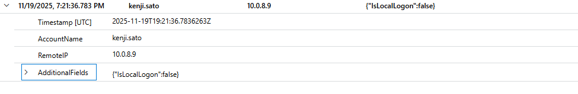

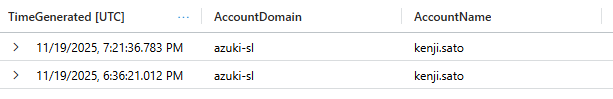

**MITRE:** T1021.001 – Remote Services (RDP)

---

## 4.2 Discovery Activity

Shortly after authentication, the attacker executed:

```
arp -a
```

This command enumerates network neighbors and indicates interactive reconnaissance.

**MITRE:** T1016 – System Network Configuration Discovery

---

## 4.3 Defense Evasion & Staging

A hidden directory was created:

```
C:\ProgramData\WindowsCache
```

Subsequent registry modifications revealed:

- File extension exclusions added to Windows Defender
- Folder path exclusions added
- Directory attributes modified to hide contents
### Evidence – Windows Defender Exclusions & Staging Directory

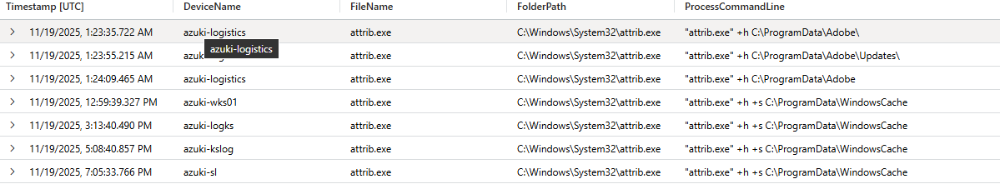

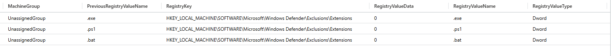

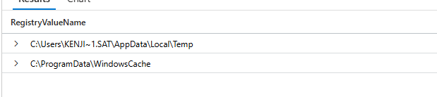

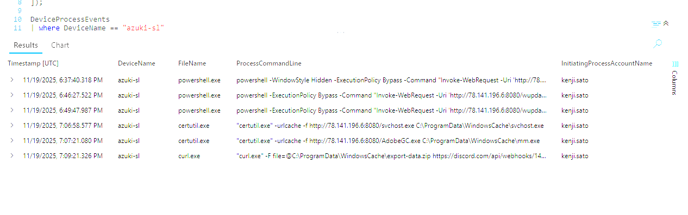
These actions impaired endpoint detection prior to tool execution.

**MITRE:**
- T1562.001 – Impair Defenses  
- T1074.001 – Local Data Staging  

---

## 4.4 Tool Ingress

The attacker used:

```
certutil.exe -urlcache
```

to download tooling into the staging directory.

Use of a native Windows binary demonstrates living-off-the-land tradecraft.

**MITRE:** T1105 – Ingress Tool Transfer

---

## 4.5 Persistence Mechanisms

### Scheduled Task

Task Name:
```
Windows Update Check
```

Execution Target:
```
C:\ProgramData\WindowsCache\svchost.exe
```

### Backdoor Administrator Account

New local admin account created:
```
support
```

Redundant persistence indicates intent for long-term access.

**MITRE:**
- T1053.005 – Scheduled Task  
- T1136.001 – Create Local Account  

---

## 4.6 Credential Access

Executable staged:

```
mm.exe
```

Executed with:

```
sekurlsa::logonpasswords
```

This module targets LSASS memory to extract authentication material.

Potential exposure includes NTLM hashes, Kerberos tickets, and cached credentials.
### Evidence – Credential Dump Execution

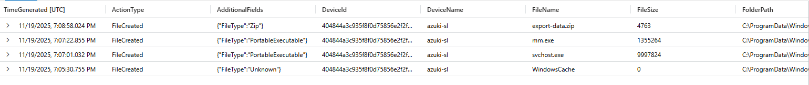

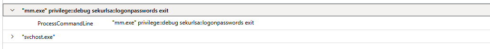

**MITRE:** T1003.001 – OS Credential Dumping: LSASS Memory

---

## 4.7 Command & Control

Repeated outbound HTTPS connections were observed to:

```
78.141.196.6
```

Destination Port:
```
443
```

Connections were initiated by `powershell.exe`, indicating encrypted C2 communications over standard web traffic.
### Evidence – Command & Control Communication

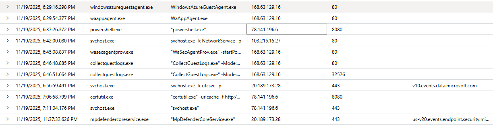

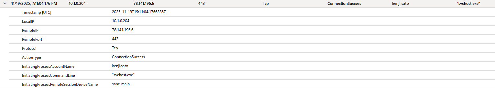

**MITRE:** T1071.001 – Web Protocols

---

## 4.8 Collection & Exfiltration

Archive created:

```
export-data.zip
```

Outbound connections to Discord infrastructure occurred shortly after archive creation, confirming data exfiltration over HTTPS.
### Evidence – Data Staging & Exfiltration

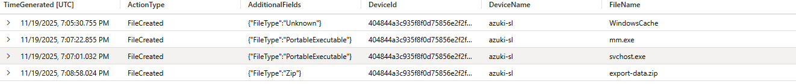

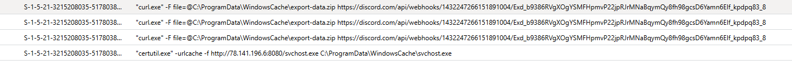

**MITRE:**
- T1560 – Archive Collected Data  
- T1567.002 – Exfiltration Over Web Service  

---

## 4.9 Anti-Forensics

Execution of:

```
wevtutil
```

First log cleared:

```
Security
```

Clearing Security logs first demonstrates awareness of forensic logging importance.
### Evidence – Event Log Clearing


**MITRE:** T1070.001 – Indicator Removal on Host

---

## 4.10 Lateral Movement

Execution of:

```
mstsc.exe /v:10.1.0.188
```

Indicates attempted RDP pivot to internal host **10.1.0.188** following credential dumping.
### Evidence – Internal Pivot Attempt

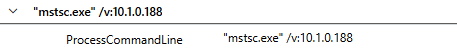

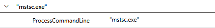

**MITRE:** T1021.001 – Remote Services

---

# 5. Indicators of Compromise (IOCs)

| Type | Indicator |
|------|----------|
| External RDP IP | 88.97.178.12 |
| C2 IP | 78.141.196.6 |
| Internal Pivot Target | 10.1.0.188 |
| Malicious Directory | C:\ProgramData\WindowsCache |
| Archive File | export-data.zip |
| Credential Dump Tool | mm.exe |
| Scheduled Task | Windows Update Check |
| Backdoor Account | support |

---

# 6. Attack Timeline (Condensed)

| Stage | Artifact |
|--------|----------|
| Initial Access | RDP from 88.97.178.12 |
| Recon | arp -a |
| Defense Evasion | Defender exclusions + hidden directory |
| Tool Download | certutil.exe |
| Persistence | Scheduled task + support account |
| Credential Dumping | mm.exe (sekurlsa::logonpasswords) |
| C2 | 78.141.196.6:443 |
| Collection | export-data.zip |
| Exfiltration | Discord |
| Log Clearing | wevtutil (Security log) |
| Lateral Movement | mstsc.exe to 10.1.0.188 |

---

# 7. Impact Assessment

The intrusion resulted in:

- Compromised administrative credentials
- Extraction of authentication material
- Theft of sensitive supplier pricing data
- Persistent backdoor access
- Attempted internal lateral movement

Credential dumping significantly increases potential blast radius beyond a single endpoint.

---

# 8. Recommendations

- Restrict RDP access to VPN or allowlisted IP ranges
- Alert on public RDP authentication events
- Monitor Windows Defender exclusion registry modifications
- Detect certutil execution with URL parameters
- Alert on LSASS memory access
- Monitor scheduled task creation outside maintenance windows
- Detect outbound Discord traffic from sensitive endpoints
- Alert on event log clearing activity

---

# 9. Skills Demonstrated

## Threat Hunting & Investigation

- Advanced KQL threat hunting within Microsoft Defender for Endpoint
- Cross-table telemetry correlation across:
  - `DeviceLogonEvents`
  - `DeviceProcessEvents`
  - `DeviceNetworkEvents`
  - `DeviceRegistryEvents`
  - `DeviceFileEvents`
- Timeline reconstruction of multi-stage intrusion activity
- Hypothesis-driven hunting methodology (lifecycle-based investigation)
- Root cause analysis of initial access vector

---

## Identity & Access Analysis

- Detection of unauthorized RDP authentication from public IP addresses
- Analysis of failed-to-successful logon patterns indicative of credential abuse
- Privileged account compromise assessment
- Detection of local administrator account creation for persistence

---

## Endpoint Detection & Defense Evasion Analysis

- Identification of Windows Defender exclusion modifications via registry telemetry
- Detection of hidden staging directories using process attribute changes
- Behavioral detection of living-off-the-land binaries (LOLBins) including:
  - `certutil.exe`
  - `powershell.exe`
- Detection of event log clearing via `wevtutil`
- Analysis of attacker anti-forensic tradecraft

---

## Credential Access & Post-Exploitation Analysis

- Detection of LSASS memory access using:
  - `mm.exe`
  - `sekurlsa::logonpasswords`
- Understanding of NTLM hash, Kerberos ticket, and cached credential exposure risk
- Blast radius assessment following credential dumping

---

## Command & Control & Network Analysis

- Identification of anomalous outbound HTTPS traffic
- Correlation of repeated connections to external infrastructure
- Isolation of C2 server (78.141.196.6) and associated port (443)
- Analysis of process-to-network relationships (`powershell.exe` initiating C2 traffic)

---

## Data Staging & Exfiltration Detection

- Detection of compressed archive creation (`export-data.zip`)
- Identification of exfiltration over trusted web services (Discord)
- Analysis of encrypted HTTPS traffic patterns associated with data theft

---

## Persistence Mechanism Identification

- Detection of malicious scheduled task creation
- Analysis of execution targets within staged directories
- Identification of redundant persistence mechanisms

---

## MITRE ATT&CK Mapping & Threat Modeling

- Mapping of observed behavior to ATT&CK techniques including:
  - T1021.001 – Remote Services (RDP)
  - T1562.001 – Impair Defenses
  - T1105 – Ingress Tool Transfer
  - T1003.001 – LSASS Credential Dumping
  - T1071.001 – Web Protocol C2
  - T1567.002 – Exfiltration Over Web Service
- Structured lifecycle analysis across Initial Access → Impact

---

## Security Operations Capabilities

- Real-world SOC-style incident documentation
- Artifact validation and evidence preservation
- Indicator of Compromise (IOC) development
- Business impact assessment tied to technical findings
- Development of actionable defensive recommendations

---

# Appendix A – Investigative KQL Queries Used to Derive Findings

The following queries represent the exact investigative pivots used to identify each stage of the attack lifecycle. These queries reflect the methodology used during analysis rather than optimized detection engineering logic.

---

## 1. Initial Access – External RDP Source

To identify remote interactive logons to the compromised workstation during the incident window:

```kql
DeviceLogonEvents
| where LogonType contains "Remote"
| where DeviceName contains "azuki-sl"
| where Timestamp between (datetime(2025-11-19) .. datetime(2025-11-20))
```

After identifying the compromised account, the query was refined to extract associated IP addresses:

```kql
DeviceLogonEvents
| where DeviceName == "azuki-sl"
| where AccountName contains "kenji"
| where Timestamp between (datetime(2025-11-19) .. datetime(2025-11-20))
| project Timestamp, AccountName, RemoteIP, LogonType, ActionType
| sort by Timestamp asc
```

This revealed public IP **88.97.178.12** associated with successful RDP authentication under account **kenji.sato**.

---

## 2. Discovery – Network Reconnaissance

To identify network enumeration activity following initial access:

```kql
DeviceProcessEvents
| where DeviceName contains "azuki-sl"
| where ProcessCommandLine contains "arp"
| where Timestamp between (datetime(2025-11-19) .. datetime(2025-11-30))
| project Timestamp, FileName, ProcessCommandLine
| order by Timestamp asc
```

This confirmed execution of `arp -a`, indicating local network reconnaissance.

---

## 3. Defense Evasion – Malware Staging Directory

To detect folder attribute modifications consistent with staging concealment:

```kql
DeviceProcessEvents
| where DeviceName == "azuki-sl"
| where Timestamp between (datetime(2025-11-19) .. datetime(2025-11-20))
| where ProcessCommandLine contains "attrib"
```

This led to identification of staging directory:

`C:\ProgramData\WindowsCache`

---

## 4. Defense Evasion – File Extension Exclusions

To detect Windows Defender exclusion modifications:

```kql
DeviceRegistryEvents
| where RegistryKey contains @"Windows Defender\Exclusions\Extensions"
| where DeviceName == "azuki-sl"
| where Timestamp between (datetime(2025-11-19) .. datetime(2025-11-20))
```

This revealed three excluded file extensions added during the attack timeline.

---

## 5. Defense Evasion – Temporary Folder Exclusion

To identify excluded folder paths:

```kql
DeviceRegistryEvents
| where RegistryKey contains @"Windows Defender\Exclusions\Paths"
| where DeviceName == "azuki-sl"
| where Timestamp between (datetime(2025-11-19) .. datetime(2025-11-20))
| project RegistryValueName
```

This identified exclusion of:

`C:\Users\KENJI~1.SAT\AppData\Local\Temp`

---

## 6. Living-Off-the-Land Download Utility Abuse

To identify abused native download utilities:

```kql
let download_lolbins = dynamic([
    "certutil.exe",
    "bitsadmin.exe",
    "powershell.exe",
    "curl.exe",
    "wget.exe",
    "mshta.exe"
]);

DeviceProcessEvents
| where DeviceName == "azuki-sl"
| where Timestamp between (datetime(2025-11-19) .. datetime(2025-11-20))
| where FileName in~ (download_lolbins)
| where ProcessCommandLine has_any ("http","https","ftp")
| project Timestamp, DeviceName, FileName, ProcessCommandLine, InitiatingProcessAccountName
| order by Timestamp asc
```

This confirmed use of **certutil.exe** with the `-urlcache` parameter for tool download.

---

## 7. Persistence – Scheduled Task Creation

To identify scheduled task creation:

```kql
DeviceProcessEvents
| where DeviceName == "azuki-sl"
| where Timestamp between (datetime(2025-11-19) .. datetime(2025-11-20))
| where ProcessCommandLine contains "schtasks"
| project ProcessCommandLine
```

This revealed creation of task:

**Windows Update Check**

---

## 8. Persistence – Scheduled Task Execution Target

Review of the `/tr` parameter within the schtasks command revealed execution target:

`C:\ProgramData\WindowsCache\svchost.exe`

---

## 9. Command & Control – C2 Server Identification

To identify frequently contacted public IP addresses:

```kql
DeviceNetworkEvents
| where DeviceName == "azuki-sl"
| where Timestamp between (datetime(2025-11-19) .. datetime(2025-11-20))
| where RemoteIPType == "Public"
| summarize Connections = count() by RemoteIP
| order by Connections desc
```

After isolating candidate IPs, further correlation was performed:

```kql
DeviceNetworkEvents
| where DeviceName == "azuki-sl"
| where Timestamp between (datetime(2025-11-19) .. datetime(2025-11-20))
| where RemoteIPType == "Public"
| where ActionType == "ConnectionSuccess"
| where RemoteIP in (
    "168.63.129.16",
    "198.235.24.12",
    "103.215.15.27",
    "78.141.196.6",
    "20.189.173.28"
)
| project Timestamp,
          InitiatingProcessFileName,
          InitiatingProcessCommandLine,
          RemoteIP,
          RemotePort,
          RemoteUrl
| order by Timestamp asc
```

Repeated connections to **78.141.196.6** initiated by **powershell.exe** confirmed C2 infrastructure.

---

## 10. C2 Communication Port

```kql
DeviceNetworkEvents
| where DeviceName == "azuki-sl"
| where Timestamp between (datetime(2025-11-19) .. datetime(2025-11-20))
| where RemoteIP == "78.141.196.6"
| project Timestamp, LocalIP, RemoteIP, RemotePort, Protocol, ActionType
| order by Timestamp asc
```

This confirmed communication over **port 443**.

---

## 11. Credential Dump Tool Identification

```kql
DeviceFileEvents
| where DeviceName == "azuki-sl"
| where Timestamp between (datetime(2025-11-19) .. datetime(2025-11-20))
| where FolderPath contains "Windowscache"
```

Identified executable:

**mm.exe**

---

## 12. Credential Dump Module

```kql
DeviceProcessEvents
| where DeviceName == "azuki-sl"
| where Timestamp between (datetime(2025-11-19) .. datetime(2025-11-20))
| where ProcessCommandLine contains "sekurlsa::logonpasswords"
| project ProcessCommandLine
```

Confirmed module:

**sekurlsa::logonpasswords**

---

## 13. Data Staging Archive

```kql
DeviceFileEvents
| where DeviceName == "azuki-sl"
| where Timestamp between (datetime(2025-11-19) .. datetime(2025-11-20))
| where FileName endswith ".zip"
| project Timestamp, FileName, FolderPath
| order by Timestamp desc
```

Identified archive:

**export-data.zip**

---

## 14. Exfiltration Channel – Discord

```kql
DeviceNetworkEvents
| where DeviceName == "azuki-sl"
| where Timestamp between (datetime(2025-11-19) .. datetime(2025-11-20))
| where InitiatingProcessCommandLine contains "WindowsCache"
```

Confirmed use of **Discord** for exfiltration.

---

## 15. Anti-Forensics – Log Clearing

```kql
DeviceProcessEvents
| where DeviceName == "azuki-sl"
| where Timestamp between (datetime(2025-11-19) .. datetime(2025-11-20))
| where ProcessCommandLine contains "wevtutil"
| project TimeGenerated, ProcessCommandLine
| sort by TimeGenerated asc
```

First log cleared:

**Security**

---

## 16. Backdoor Account Creation

```kql
DeviceProcessEvents
| where DeviceName == "azuki-sl"
| where Timestamp between (datetime(2025-11-19) .. datetime(2025-11-20))
| where ProcessCommandLine contains "/add"
| sort by TimeGenerated asc
```

Created account:

**support**

---

## 17. Malicious Script Execution

```kql
DeviceFileEvents
| where DeviceName == "azuki-sl"
| where Timestamp between (datetime(2025-11-19) .. datetime(2025-11-20))
| where FileName endswith ".ps1" or FileName endswith ".bat"
| project Timestamp, DeviceName, FileName, ActionType, InitiatingProcessFileName, FolderPath
| order by Timestamp desc
```

Identified script:

**wupdate.ps1**

---

## 18. Lateral Movement – Secondary Target

```kql
DeviceProcessEvents
| where DeviceName == "azuki-sl"
| where Timestamp between (datetime(2025-11-19) .. datetime(2025-11-20))
| where ProcessCommandLine contains "mstsc"
| project ProcessCommandLine
```

Confirmed pivot to:

**10.1.0.188**

---

## 19. Lateral Movement – Remote Access Tool

Confirmed tool used:

**mstsc.exe**

---

# Appendix B – Screenshots


## Initial Access – RDP Authentication


## Discovery – Network Recon


## Defense Evasion


## Persistence
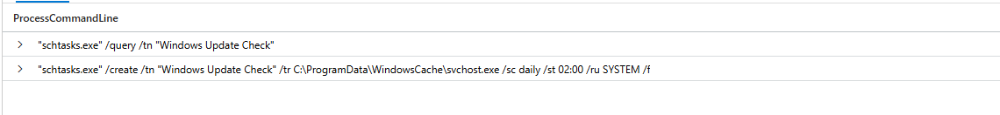
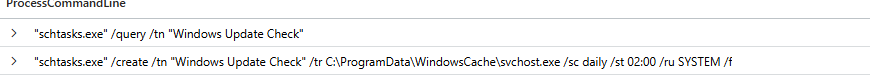


## Credential Access


## Command & Control


## Collection & Exfiltration


## Anti-Forensics


## Execution
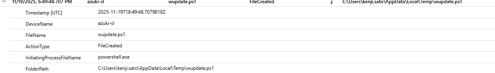

## Lateral Movement


---
